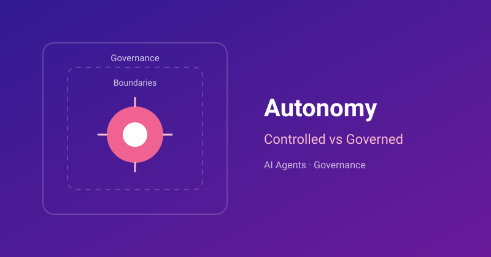

# Blog Overview

Welcome to the Blog section. This page is the central place for curated posts and resources.

## Featured posts

-   { .contain loading=lazy }

    [System One Models & Jev](posts/system-one-model/system-one-model-jev.md){ .post-card__link }

    Sep 24, 2026 · AI · LLM

    Fast, typed, calibrated decisions for software. How System One models differ from LLMs, and where to use them.

-   { loading=lazy }

    [Autonomy in Modern AI Systems](posts/agent-autonomy/controlled-vs-governed-autonomy.md){ .post-card__link }

    Aug 4, 2026 · AI · Agents

    What "autonomous" really means, and the difference between controlled and governed autonomy.

-   { loading=lazy }

    [WSL2 on Windows](posts/wsl2-on-windows/wsl2-on-windows.md){ .post-card__link }

    Jan 23, 2023 · Dev Setup

    Setting up a Linux development environment and container tooling on Windows with WSL2, with tips for common issues.

-   { .contain loading=lazy }

    [Internet Protocol Suite](posts/internet-protocol-suite/internet-protocol-suite.md){ .post-card__link }

    Jun 16, 2020 · Networking

    The four layers of TCP/IP, how data is encapsulated as it moves through them, and how they map to the OSI model.

-   { loading=lazy }

    [Digital Twin & Actor Model](posts/digital-twin-actor-model/digital-twin-actor-model.md){ .post-card__link }

    Nov 13, 2017 · IoT · Azure

    Modelling IoT devices as digital twins using the Actor pattern on Azure Service Fabric.

