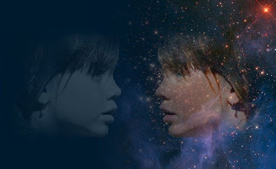
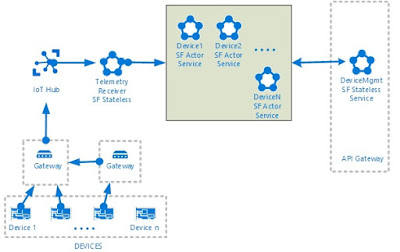
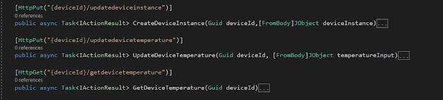

*Digital Twin is a digital representation of physical objects like device, process or system. In IoT world, digital twin can help us monitoring entire life cycle of devices. AI and Machine Learning modules can be integrated with digital simulation. Digital twin needs to be updated frequently so that it maintains same copy of physical object’s properties and state. 3D modeling and Augmented reality can be used to enable visualization with respect to creation and monitoring of Digital Twins.*

In this topic, let us see how Digital Twin, Actor Pattern and Azure Fabric can be useful.

In today’s world, Micro service based architecture has decent impact on business. Businesses needs to be true agile on whatever they are doing — it could be Development, Efficient/Faster deployment, Effective maintenance and so on…Traditional architectures are good on separation of layers but they are very difficult to scale and maintain. To meet the above needs, micro service based architecture splits entire systems into small and independent services.

Stateless services need to maintain state in a separate persistence store. In the Modern computing world, it is always better to keep the compute and store together. Stateful services are useful in this context.

Azure service fabric is a micro services platform to build scalable and reliable micro services. This is a PaaS offering from Microsoft. It supports container based apps, Stateless service, Stateful service and Actor service.  For more information refer [Azure Service Fabric](https://learn.microsoft.com/en-in/azure/service-fabric/service-fabric-overview)

## Actors and Digital Twin and IoT

Actors are independent single unit of state and logic. It is based on [Actor Pattern](https://en.wikipedia.org/wiki/Actor_model). Actors are computational units deployed with a large number and executes simultaneously and independently of each other. They can communicate with each other and also can create more actors.

In Microsoft world, it is called Service Fabric Reliable Actors which is an implementation on actor design pattern. Refer Microsoft documentation on [Reliable Actor](https://learn.microsoft.com/en-us/azure/service-fabric/service-fabric-reliable-actors-introduction).

Internet of things (IoT) is where huge number of things are connected. Apart from the security and management of things/devices, it is also important to have a digital representation of them.  This virtual model of devices exist in the Cloud and it has both state and logic. The model can be updated with the telemetry data produced by the device or sensors. This can be an enabler towards Digital Twin where we can have virtual model of process, product or service.

Following are few use cases that can be addressed –

- Can have Digital Twin as simulated objects and push the changes to virtual model and observe the effects
- Monitoring and diagnostics of physical objects using Digital Twin
- Combination of digital twin and 3D modeling enables better visualization for both creation and - monitoring of physical devices
- Artificial Intelligence and Machine Learning modules can be integrated with Digital Twin.

## Architecture – Service Fabric Actor and IoT

This is a simple architecture to show the basic capabilities of Actor service to enable a basic digital twin. Let us see how to create and publish a digital twin using REST based API service and update the same with continuous telemetry. Also, we will see how to  implement REST based API to GET updated property values.

We can create virtual model of Devices inside Service Fabric Cluster. It can be huge in number depending on the deployment on IoT solution. These Device Actors type contains information related to the actual device instance. Each actor instance has unique Id to identify. We can publish our device meta data and maintain other computational aspect of that device Type.

Just for this scenario I am trying to explain Actor model using IoT but remember actor model can be used on various other scenarios. In the above picture, API Gateway enables interaction with Digital twin which has all the relevant operations related to device – one of them could be creating device instance in service fabric cluster.

Physical devices are connected to IoT hub which is nothing but a cloud gateway where devices can be connected and managed securely.  Once devices are connected to IoT Hub and the telemetry payload is uploaded to the cloud, Telemetry receiver (could be stateless or stateful) receives messages and identifies the right device actor to be updated. To resolve correct actor, payload should have right identifier or some mapping identifier. Also, REST based API can be used to update properties.

For Sample code refer [GitHub](https://github.com/Chittapriya/DigitalTwin) repository.

## Conclusion

As explained before these actors are single threaded and it will be available in the memory. No separate persistence is needed and an actor will have both state and logic. At any point of time, Business operations can have the latest snapshot of the devices. It also can have aggregation of values or some KPI based logic. It supports timers, reminders and sending notifications. Send notification feature is helpful to publish events to a client. This technology has good capabilities to create and maintain digital twins for both cloud and on-premise.

