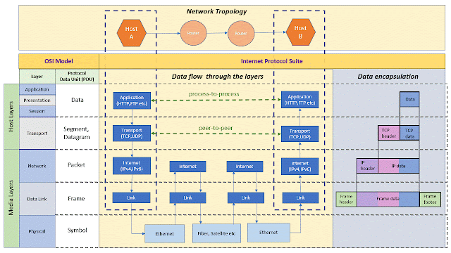

Internet Protocol Suite is the protocol stack used on internet. This is a conceptual model built based on a set of communication protocols used in internet. It is commonly known as TCP/IP because of two main protocols – TCP (Transmission Control Protocol) and IP (Internet Protocol). It consists of four conceptual layers –

1. Application Layer
2. Transport Layer
3. Internet Layer
4. Link Layer

These layers are not directly mapped to OSI communication model, rather it is loosely mapped to the seven layers of OSI communication model.

## Architecture

Above pictures explains how data flows through the layers and data encapsulation at each layer. it also shows a mapping of OSI communication model. However, if only represents a loosely mapped 7 layers of OSI communication model.

### Link Layer
Link layer is a local network connection attached to a host. This consists of specialized hardware, virtual private networks (VPN) and network tunnels. Packets are transmitted and received via this link layer, moved by utilizing device drivers, firmware to transmit the frames to Physical layer.

### Internet Protocol Layer
Internet protocol layer is used to send data packets (called datagrams) from source network to destination network. It can accommodate any transport layer protocol which can carry different data structures. This means, internet protocol layer is agnostic to both data structure and transport layer. It uses a routing technique to identify the path inside/across networks. Routing uses different type of delivery schemes and algorithms to determine the paths. Routing delivery schemes are –

- **Unicast** – delivering messages to a specific node; one-to-one
- **Broadcast** - delivering messages to all the nodes; one-to-all
- **Multicast** – delivering messages to a specific group of nodes; one-to-many-of-many or many-to-many-of-many
- **AnyCast** – delivering messages to a specific node of a group of nodes; one-to-one-of-many
- **Geocast** – delivering messages to a group of nodes available in a specific Geographic location; one-to-many-of-many-at-geolocation

It uses Internet Protocol Version 4 which is a 32-bit address. Now, in today’s world of Internet of Things IPv4 is not sufficient to accommodate all IPs. To overcome this Internet Protocol Version 6 which uses 128-bit addresses.

### Transport Layer
Transport Layer enables peer-to-peer communication between hosts. This acts as a data channel and this is independent of the data structure defined by the users. It supports two modes of communications 1. Connection oriented and 2. Connection less. Transmission Control Protocol (TCP) is the implementation of connection oriented and User Datagram Protocol (UDP) is for connection less. It maps to the 4th layer of OSI Communication model.

### Application Layer
Application Layer uses different type of protocols to exchange data between applications. This layer provides required abstraction for the transport and lower layers. Some of the popular protocols are  Hypertext Transfer Protocol (HTTP), File Transfer Protocol (FTP), Web Socket, Simple Mail Transfer Protocol (SMTP). It combines top three layers (Application, Presentation and Session) of OSI communication model.

## How internet has evolved overtime?

*It’s amazing to see how the contribution from different research put together created Internet which made a great impact to the society. It is worth knowing on all the contributors and the concepts which is still valid for modern architecture.*

In 18th century, the study of electromagnetism had given opportunity to build long distance communication systems. Two significant research focus were Electric Telegraphy and Wireless Telegraphy. I will keep the focus on Electric Telegraphy and Telephony to explain the history of internet.

An effective long-distance communication was started with Electric Telegraph. The core concept was transmitting electric signals over a wire. It all started with Battery(cell) invention in 1800 by an Italian physicist Alessandro Volta (1745-1827). In 1820, Danish physicist Hans Christian Oersted (1777-1851) identified a connection between electricity and magnetism. The demonstration could deflect a magnetic needle using electricity. Researchers across the world were working on a communication system based on the principle of electromagnetism. Electric telegraph was invented separately by two sets of researchers: Sir William Cooke (1806-79) and Sir Charles Wheatstone (1802-75) in England, and Samuel Morse (1791-1872), Leonard Gale (1800-83) and Alfred Vail (1807-59) in the U.S. In 1830s British researchers (Cooke and Wheatstone) developed a telegraph system in which a magnetic needle could point to a letter or number printed in a panel. In 1832, Morse developed an electric telegraph which was based on dots and dashes. Later, he had a partnership with Alfred Vail and together they made lot of improvements in Morse system. They created a single-circuit telegraph that worked by pushing the operator key down to complete the electric circuit. This requires sending an electrical signal over the wire and a receiver at another end. In 1843, they got funding from U.S. government to setup a telegraph system. A wired connection was made from Washington, D.C., and Baltimore, Maryland. On May 24, 1844, a historic day; a first message transmitted: “What hath God wrought!". This started a new era of electric Telegraph. They also developed a code called Morse code for effective transmission of messages. Each letter was having a unique code and when code is reached at other end; it makes a mark in a piece of paper and later translate back in English. Later operators were able to understand the code by listening the clicks at receiver end.

This telegraph era was survived for next 100 years and series of innovation and initiatives were made. Few major events are listed below -

- In 1856, Western Union Telegraph Company was formed
- In 1865, International Telegraph Union was formed
- In 1871, transmission improvement happened where first duplex system is introduced where same line can be used for both sending and receiving communication.
- In 1871, Jean-Maurice-Émile Baudot introduced a concept called multiplexing (switching). In this system, correct transmitter and receiver had to be connected.
- In 1872, Western Electrical Manufacturing company was formed (It was initially an electrical company started under the name of Gray and Barton in 1869). 
- In 1874, Thomas Alva Edison introduced a quadraplex telegraph system where 4 messages were transmitted simultaneously in a single line.
- In 1876, Alexander Graham Bell invented Telephone.
- In 1877, Bell Telephone Company and a sister company “New England Telephone and Telegraph Company” were formed. Later in 1879, merger happened and two new entities were formed - National Bell Telephone Company of Boston, and the International Bell Telephone Company
- In 1880, American Bell Telephone Company was formed. Merger between National Bell Telephone Company and American Speaking Telephone Company.
- In 1882, American Bell Telephone Company acquired Western Electrical Manufacturing company.

Until 1950, communication was all about telegraph, telephone network and broad cast radio (wireless). On 4th October 1957, Soviet Union successfully launched Sputnik which was the world’s first artificial satellite. In response to this event, U.S. defense launched an advanced research program. The internet we are seeing today, was started with a defense/military initiative. As it says, “Necessity is the mother of all invention”, probably the ambition to conquer the world and create a footprint; gave us technology that no one could imagine at that time.

On 7th-February-1958, Advanced Research Projects Agency (ARPA) was formed, later it was renamed to Defense Advanced Research Projects Agency (DARPA).

Main 2 core concepts were very popular at that time – **Time Sharing** and **Packet Switching**.

**Time Sharing** – An interesting concept was getting developed where a computer can be used simultaneously by multiple users. The whole idea was to handle multiple problems concurrently. Lot of researchers contributed to this idea. The first idea proposal was done by John Backus in the 1954, followed by many new developments in late 1950s and early 1960s.

**Packet Switching** – A significant contributions were made by 3 research organizations –

- RAND Corporation (Military Network)
- National Physical Laboratory – NPL (Commercial Network)
- CYCLADES (Scientific Network)

In 1960s Donald Davis (UK) from NPL gave the first idea on “Packets”. In his proposal, data were split into multiple packets and assembled back at receiver end. Also, Paul Baran from RAND Corporation, proposed similar idea. Baran proposed dividing data into “message blocks” before sending them across network and rejoin them after collecting at the receiver end. Packet switching is a store and forward mechanism. In a network there were Switch points called switch (also called router) which examines the packet’s destination address and forwards the messages in an appropriate line. In 1965, Donald Davis proposed another paper on packet switching which envisioned to transfer computer data over routers. Other side at RAND Corporation, Paul Baran continued his research on distributed computing and decentralized architecture of networks. He also proposed digital packet switching over analog system. Many papers were published on distributed communication. He proposed a distributed communication where data can still be transmitted even if few nodes(routers) are damaged. He proposed a scheme called “hot-potato-routing” to transmit messages.

Other developments were also happening in parallel. In 1961, Len Kleinrock from MIT, published a paper called “Information flow in large communication nets”. In 1962, another and most important idea came out from MIT professors J. Licklider and W. Clark called “Man computer communication” where they envisioned users to use terminals to use large computers. Licklider proposed another concept called “Galactic Network”.

In 1966, L. Roberts (DARPA) proposed a computer network called ARPANET to share information. This initiative gave us the foundation for Internet.

In 1967, ARPANET gave a contract to Bolt Beranek and Newman (BBN) to build Interface Message Protocol (IMP) which would implement packet switching over nodes. Main idea was to connect computers over telephone network. BBN created first piece of IMP hardware which can be attached to the computer.

In 1969, it was planned to send first message “LOGIN”. The setup was established between USCLA and STANFORD. This setup was able to send L and O but system crashed when it tried transmitting G…. There is nothing called failure in scientific research and on that day, the world got something to take it forward.

Later the network got expanded across U.S. The first ever routing protocol which was used in ARPANET was “distance vector routing”.

In 1971, a program called CPYNET used ARPANET to send files to remote computers. Ray Tomlinson introduced a concept called EMAIL by introducing @ symbol which attach a host name to the message.

In 1972, France delegates created another network called CYCLADES (inspired by ARPANET). It introduced interesting concepts like “datagrams” where network host was responsible for data than the network itself. This had huge influence in designing TCP/IP protocol. It also worked on many interesting concepts like sliding window protocol, Layered architecture for networks.

In 1972, the idea of open architecture was first proposed by Bob Khan. He introduced a protocol called Network Control Protocol (NCP). NCP did not have the ability to address individual machines other than a destination to IMP. In between 1973-75, Vint Cerf and Bob Khan together created TCP (Transmission Control Protocol) and IP (Internet Protocol). TCP used sliding window protocol.

Now, the requirement on standardization was very prominent as there were various networks with different types of packet switching implementations. This was having an interoperability issue. Khan’s rules of interconnection were recommended –

- Each network is independent and must not be required to change
- Best-effort communication 
- Boxes/Gateways connect networks 
- No global control at operations level  

Initial proposal came for 8 bit network identification which could cover 256 addresses.

In 1973, ARPANET was extended to trans-Atlantic connection where Email was the popular application.

In 1975, first email client was created by John Vittal (University of Southern California)

In 1977, PC modem was developed by Dennis Hayes and Dale Heatherington.

In 1978, a concept of layering came into the picture. TCP and IP were separated; TCP is used at the endpoints and IP in the networks. Then ISO (International Standardization Organization) was created. They came up with a 7-layer OSI reference model.

In 1979, IP version 4 was documented.

From 1979 to 1982 many applications are created like Usenet, ENQUIRE software, emotion. First emotion was “:-)”

In 1982-83, U.S. defense standardized on TCP/IP stack. ARPANET installed TCP/IP stack in production. Berkeley’s computer created Unix based machines with TCP/IP stack and sockets.

In 1984, DNS (Domain Name Service) was introduced.

In 1985, National Science Foundation (NSF) selected TCP/IP as the standard internet backbone to connect all the networks together.

In 1989, AOL was launched.

In 1989, Tim Berners-Lee proposed World Wide Web (WWW). It was initially called “Mesh”

In 1990, ARPANET was shut down.

This was a new beginning……today we can see how internet has become the part and parcel of our daily lives!

References-

- https://www.history.com/topics/inventions/telegraph
- https://www.britannica.com/topic/Western-Electric-Company-Inc
- https://www.britannica.com/technology/telegraph
- https://www.youtube.com/watch?v=oIezCGjxV3A
- https://www.youtube.com/watch?v=RN4gSBTANUY
- https://en.wikipedia.org/wiki/Bell_Telephone_Company
- https://www.britannica.com/topic/Defense-Advanced-Research-Projects-Agency
- https://www.webfx.com/blog/web-design/the-history-of-the-internet-in-a-nutshell/
- https://www.communicationsmuseum.org.uk/emuseum/packetswitching/
- http://student.ing-steen.se/IPv4/TCP-IP.pdf
