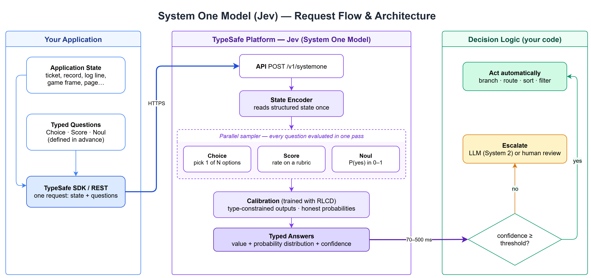
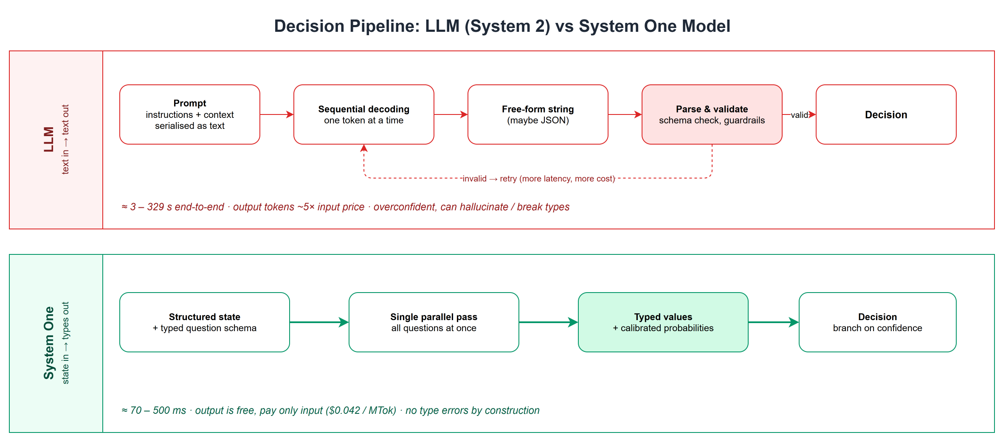

## The Problem: We Keep Using Essay Writers as If-Statements

Large Language Models are remarkable at *thinking out loud*. They write, explain, reason and converse.
But look at how most production software actually uses them:

- *"Is this support ticket urgent?"* → parse `"yes"` out of a paragraph
- *"Which queue should this go to?"* → hope the JSON is valid
- *"Is this prompt a jailbreak?"* → retry when the model invents a new category

In each case the program doesn't want prose. It wants a **decision**: a boolean, a label or a score that it can branch on.
We ask a text generator to write text, then parse that text back into a structure, validate it, and retry when it breaks.
That round trip is slow, expensive and fragile.

**System One models**, introduced by [TypeSafe](https://typesafe.ai/blog/introducing-system-one-models-and-jev), are built for this gap. **Jev** is the first of them.

---

## What Is a System One Model?

The name comes from Daniel Kahneman's two modes of thinking:

| | **System 1** | **System 2** |
|---|---|---|
| Style | Fast, intuitive, automatic | Slow, deliberate, effortful |
| Human example | "That face looks angry" | "What is 17 × 24?" |
| AI analogue | **System One models (Jev)** | **LLMs with reasoning** |

TypeSafe describes System One models as

> "a new class of frontier models built to make fast, structured decisions that software can use directly."

A System One model does not generate text. You give it **state**, meaning the data your program already holds, and a set of **typed questions** that you define in advance. It returns **typed answers with calibrated probabilities**.

TypeSafe calls it a *frontier-intelligence function call*:

> **Unstructured state in → typed probabilistic decisions out.**

## What Is Jev?

**Jev** is TypeSafe's first System One model. It is named after the economist **William Stanley Jevons**. The *Jevons paradox* says that when steam engines used coal more efficiently, total coal demand went **up**, not down. TypeSafe expects machine intelligence to follow the same path: when decisions become almost free and very fast, software will make far more of them.

Jev is built on a stack designed for automation from the ground up:

- **A new model architecture** that produces structured values rather than tokens
- **A parallel sampler** that answers every question in a single hardware-aware pass
- **RLCD (Reinforcement Learning for Calibrated Decisions)**, a training method that optimises for *epistemically honest probabilities* instead of human preference (RLHF) or verifiable rewards (RLVR)

---

## Architecture: How a Request Flows




1. **Your application** already holds some state: a support ticket, a database record, a log line, a game frame.
2. It declares **typed questions** using three primitives (see below) and sends state and questions in **one request** to `POST /v1/systemone`.
3. **Jev** reads the state once and evaluates **every question in parallel against that same state**. The questions are independent, so a long list of them does not cause *context rot*.
4. Outputs are **type-constrained**: the model can only return values that match the schema you declared.
5. Each answer includes the **value, the full probability distribution, and a confidence score**.
6. **Your code** decides what to do. Above a confidence threshold, act automatically. Below it, escalate to an LLM (System 2) or to a human.

### The Three AI Primitives

| Primitive | Question it answers | Returns |
|---|---|---|
| **Choice** | "Pick one option from this list" | chosen option + probability per option + confidence |
| **Score** | "Rate this state on a rubric" | score + probability distribution + confidence |
| **Noul** | "Is this statement true?" | a single number in `0–1`: the probability that the answer is *yes* |

The design principle is **atomic questions**. Each question should ask one specific, well-scoped thing that a knowledgeable person could judge in a few seconds. Complex decisions are split into several small questions, and the **logic that combines them lives in your code, not in a prompt**.

### What It Looks Like in Code

```python
from typesafe_sdk import Noul, NoulCriteria, TypeSafeClient

with TypeSafeClient() as client:
    response = client.system_one(
        model="jev-latest",
        state="I have asked three times now. Can I please just talk to a real person?",
        questions={
            "is_human_escalation": Noul(
                instructions="Is the customer asking for a human agent?",
            ),
            "is_repeat_contact": Noul(
                instructions="Has the customer contacted support about this before?",
                criteria=NoulCriteria(
                    true="Mentions a prior attempt, ticket, or that they have asked before",
                    false="No sign of any previous contact",
                ),
            ),
        },
    )

    if response.answers["is_human_escalation"].noul > 0.8:
        route_to_human_agent()
```

The code has no prompt template to maintain, no JSON parsing and no retry loop. The answer is already a number you can compare against a threshold.

*(Install with `pip install typesafe-sdk`, Python 3.10+. There is also a REST API and a playground at console.typesafe.ai.)*

---

## How Is This Different from Existing LLMs?




An LLM path has several extra steps: serialise the context into a prompt, decode token by token, get a string back, parse and validate it, and retry if it is wrong. The System One path is shorter: state and schema go in, a single parallel pass runs, and typed values come out.

| Dimension | LLMs | System One (Jev) |
|---|---|---|
| **Training objective** | RLHF / RLVR, optimised for human preference | RLCD, optimised for *calibrated decisions* |
| **Input** | Sequential messages (chat) | Structured program state |
| **Output** | Strings: flexible but unpredictable | Type-safe structured values |
| **Generation** | Sequential, one token at a time | Parallel, all outputs in one pass |
| **Latency** (vendor-reported) | ~3 s to 329 s end-to-end | ~70 ms to 500 ms |
| **Cost** | Output tokens ~5× the input price | Input $0.042 / MTok; output "too cheap to meter" |
| **Type errors / hallucinated labels** | Possible even with careful prompting | Impossible by construction: outputs are restricted to the declared schema |
| **Confidence** | Often overconfident and inconsistent | Calibrated: higher confidence means higher accuracy, and similar inputs give similar answers |
| **Best at** | Writing, chat, open-ended reasoning, agents | Classify, route, score, extract, verify, at scale |

TypeSafe reports that on its workflow evaluations Jev reaches **similar accuracy to frontier LLMs on System One-style tasks while being about two orders of magnitude faster and cheaper**. At the high end they cite about **193× faster and 444× cheaper**. The reference answers came from averaging frontier LLMs (GPT-6 Astra and Fable 5.1).

---

## Advantages

1. **Speed you can put in a UX path.** Around 100 ms is fast enough for inline, user-facing features such as autocomplete-style routing, live moderation or in-game bots. TypeSafe's Doom demo runs at 10 decisions per second.
2. **Cost that changes the economics.** When output is effectively free and input is cheap, you can run AI over every row, log line or event instead of a sample.
3. **No type errors and no invented categories.** The model cannot return a label you did not define. For systems with latency guarantees, one malformed response can be a deal-breaker, and this removes that failure mode.
4. **Calibrated confidence is a control knob.** You can set thresholds such as "auto-approve above 0.95, send to review between 0.6 and 0.95, reject below 0.6", then tune precision and recall like any other classifier.
5. **Consistency.** Similar inputs produce similar answers, which makes behaviour easier to test and audit than sampled free text.
6. **Composable, testable logic.** Atomic questions combined in ordinary code are easier to unit-test, version and reason about than a single large prompt.
7. **No context rot.** Each question is evaluated independently against the same state, so adding the 20th question doesn't degrade the first.

## Disadvantages and Limitations

1. **No text generation.** It cannot write, summarise, explain or chat. That trade-off is deliberate, but it rules out a large set of LLM use cases.
2. **Decisions must be pre-defined.** You need to know the output space in advance. Open-ended questions ("what is wrong with this code?") don't fit.
3. **Cardinality limit.** A Choice supports up to **255 options**. Larger label spaces need a two-stage (hierarchical) setup.
4. **Text-only state for now.** Images and other modalities are not yet supported.
5. **Not a reasoner.** It is System 1 by design. Multi-step reasoning, planning and tool use are still LLM territory.
6. **Benchmarks are vendor-reported.** TypeSafe acknowledges that its evals were run by its own team from the US West Coast, so there may be bias. Validate on your own data before relying on the numbers.
7. **Question design becomes the new prompt engineering.** Accuracy depends on well-scoped, atomic questions and clear criteria. Poorly decomposed questions still give poor answers, just typed ones.
8. **Calibrated does not mean correct.** A 0.7 is still wrong 30% of the time. You still need thresholds, fallbacks and monitoring.
9. **A new vendor and API.** It is a separate model family and platform, which brings the usual questions about lock-in, data residency and maturity.

---

## Use Cases: Where System One Models Fit

The rule of thumb is: **if the answer is a label, a score or a yes/no, and you need it fast or at volume, it's a System One task.**

| Area | Example questions | Primitive |
|---|---|---|
| **Customer support triage** | Is this urgent? Which team owns it? Is the customer asking for a human? | Noul, Choice |
| **Smart if-statements in workflows** | Should this invoice be auto-approved? Does this PR touch security-sensitive code? | Noul, Choice |
| **Content moderation & trust/safety** | Is this post harassment? How severe, on a 1–5 rubric? | Noul, Score |
| **LLM guardrails & jailbreak detection** | Is this prompt a jailbreak attempt? Does this answer leak PII? | Noul |
| **LLM-as-a-judge / evaluation** | Score this response for faithfulness, relevance and tone | Score |
| **Large-scale data labelling & feature extraction** | Categorise millions of records, reviews or log lines into features | Choice, Score |
| **Lead scoring & sales ops** | How likely is this lead to convert? Which segment is it in? | Score, Choice |
| **Real-time applications & games** | Which action should the agent take this frame? (the Doom demo) | Choice |
| **Search, ranking & routing** | Which of these links best moves toward the goal? (the Wikiracing demo) | Choice |
| **Fraud & anomaly flagging** | Does this transaction pattern look suspicious? | Noul |
| **Model routing (System 1 → System 2)** | Is this query simple enough to answer cheaply, or does it need a reasoning LLM? | Noul, Choice |

### Pattern: System 1 + System 2 Together

The most practical architecture uses both kinds of model rather than picking one:

1. **Jev handles the 90% case**: fast, cheap, typed decisions on every event.
2. When **confidence is low**, the item escalates to an **LLM** (System 2) or a **human**.
3. The LLM does what it is good at: reasoning, explaining and writing.

This is the same split humans use. Most of the day runs on fast intuition, and slow deliberation is saved for the cases that need it.

### Where Not to Use It

- Creative writing, summarisation, drafting emails
- Conversational assistants and chatbots
- Code generation, multi-step planning, agentic tool use
- Any task where you cannot list the possible answers in advance

---

## Closing Thoughts

For the last few years the default has been *"use an LLM for everything."* System One models challenge that. Much of what software needs from AI is not language but **judgement**: quick, typed, confidence-scored decisions that plug into ordinary `if` statements.

If TypeSafe's numbers hold up on real workloads, the Jevons comparison may turn out to be accurate. When a decision costs a fraction of a cent and takes 100 ms, teams will add AI to many parts of their systems where it is currently too slow or too expensive.

The sensible starting point is to take one high-volume, well-defined decision in your system, write it as a few atomic questions, and benchmark Jev against your current LLM call on **your own data**.

---

## References

- TypeSafe — [Introducing System One Models and Jev](https://typesafe.ai/blog/introducing-system-one-models-and-jev)
- TypeSafe Docs — [Introduction](https://docs.typesafe.ai/introduction)
- Daniel Kahneman — *Thinking, Fast and Slow* (2011)
